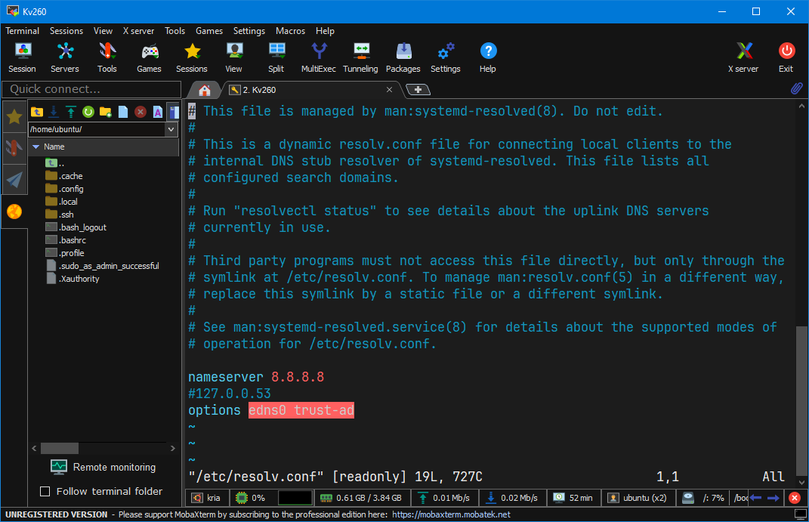

<h1 align="center" >Setup Networking </h1>

## *1. Fix lỗi no network*
Kiểm tra mạng xem đã có ip chưa vs lệnh `ip a`. Nếu chưa thực hiện các bước sau.

```
nano /etc/resolv.conf 
```
Mở file lên và đổi địa chỉ dns thành `8.8.8.8` như trên hình 

<p align="center">
  
</p>

Sau đó kiểm tra lại 1 lần nữa xem đã có ip không 
```
3: eth0: <BROADCAST,MULTICAST,UP,LOWER_UP> mtu 1500 qdisc mq state UP group default qlen 1000
    link/ether 00:0a:35:23:bd:9d brd ff:ff:ff:ff:ff:ff
    inet 192.168.0.78/24 brd 192.168.0.255 scope global dynamic noprefixroute eth0
       valid_lft 6370sec preferred_lft 6370sec
    inet6 fe80::6eff:a864:b8ac:8eb3/64 scope link noprefixroute
       valid_lft forever preferred_lft forever
```
