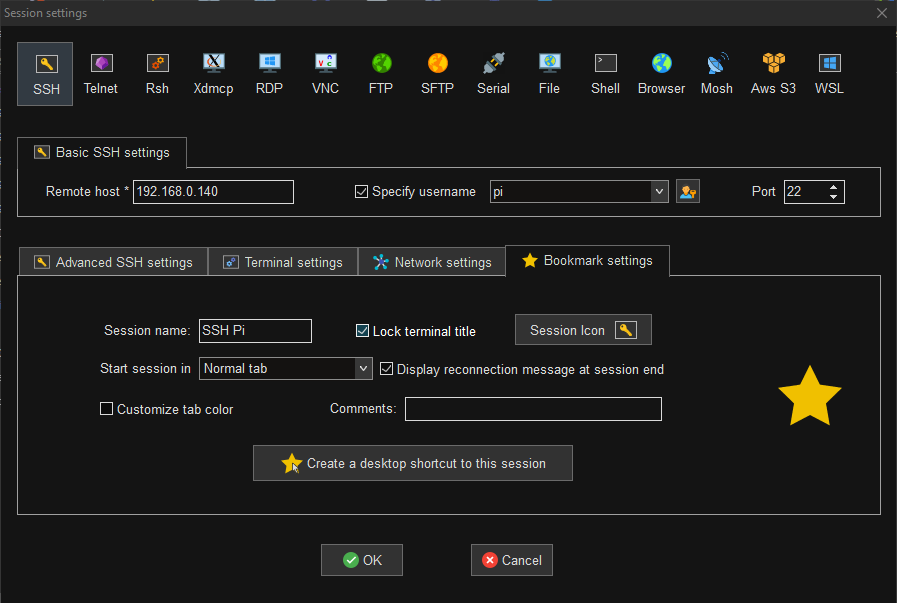
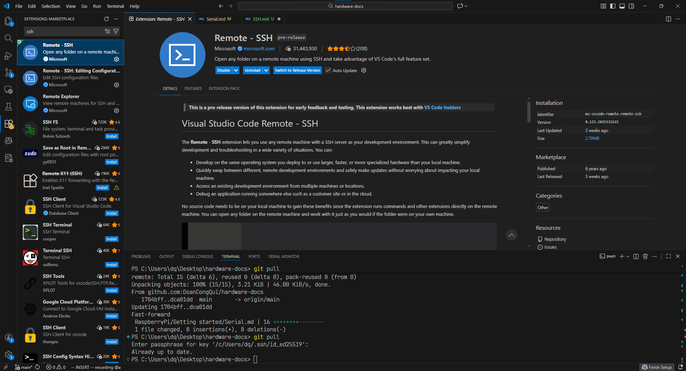
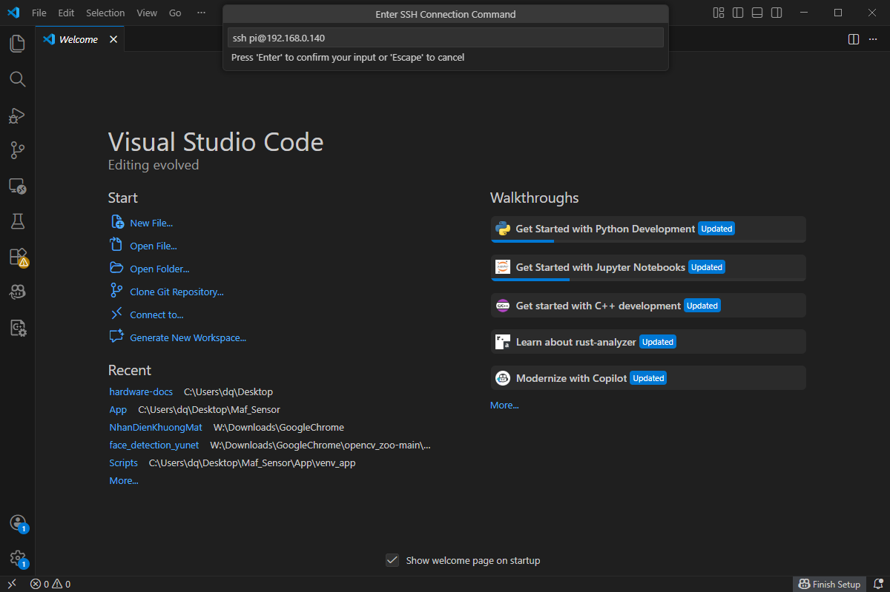
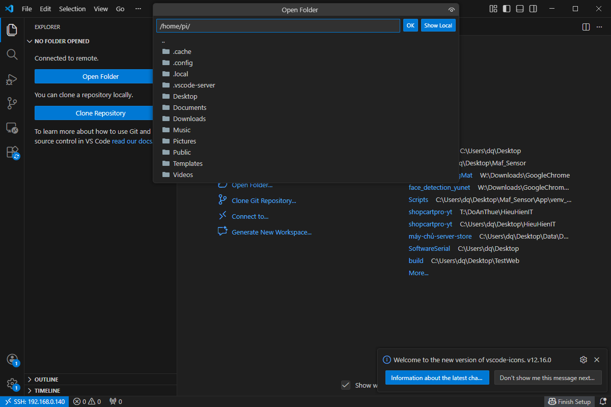

<h1 align="center" >Remote setup of a Raspberry Pi via SSH </h1>

*`Chú ý:`* **Điều kiện để connect được tới pi là phải sử dụng chung 1 đường truyền mạng.**

[Youtobe hướng dẫn setup](https://www.youtube.com/watch?v=jvi1nmKK81Y)

## *1. Connect ssh vs MobaXterm*

Mở ứng dụng [MobaXterm](https://mobaxterm.mobatek.net/download-home-edition.html)

<p align="center">
  
</p>


1. Mở MobaXterm → Session

2. Chọn SSH

3. Điền:

- `Remote host`: 192.168.0.140 (IP của Pi)

- Tick `Specify username` → nhập pi (hoặc user đã tạo)

- `Port`: 22 

- `Session name`: đặt tên dễ nhớ `VD: “SSH Pi”`

Bấm `OK` → MobaXterm sẽ hỏi mật khẩu → nhập `password` → `Enter`

## *2. Connect ssh vs VsCode*

Mở ứng dụng [Vscode](https://code.visualstudio.com/download)

### *2.1 Cài extension cần thiết*

Trong `VS Code` → `Extensions` or ` Ctrl + Shift + X`: 

Cài đặt  `Remote - SSH (Microsoft)` như hình bên dưới.

<p align="center">
  
</p>

### *2.2 Tạo kết nối SSH trong VS Code* 

1. Nhấn `Ctrl + Shift + P`

2. Gõ: `Remote-SSH`: `Add New SSH Host…`

Nhập lệnh (đúng IP của Pi):
```
ssh <user>@<IP raspberry pi>
```
VD: user: `pi` & IP: `192.168.0.140` thì nhập lệnh `ssh pi@192.168.0.140`

<p align="center">
  
</p>

Chọn file config để lưu (thường là):

`Windows: C:\Users\<you>\.ssh\config`

Sau đó:

`Ctrl + Shift + P` → Chọn `Remote-SSH: Connect to Host…` → Chọn host vừa tạo

*`Chú ý`*: Khi lần đầu connect

*VS Code sẽ hỏi:*

1. Select platform → chọn `Linux`

2. Continue / Accept host key → `Yes`

3. Nhập `password` của user trên Pi
(hoặc dùng SSH key nếu bạn setup)

*Kết nối xong góc trái dưới sẽ hiện: SSH: `192.168.0.140`(hoặc tên host).*

### *2.3 Mở folder code trên Pi* 

Trong VS Code (đang SSH):

File → Open Folder…

Chọn ví dụ: `/home/pi/Documents`

<p align="center">
  
</p>

VS Code sẽ làm việc trực tiếp trên Pi thông qua network.

*`Điểm yếu của ssh là khi mạng yếu thời gian trễ sẽ tăng lên làm người dùng cảm giác bị lag khi đang sử dụng`*