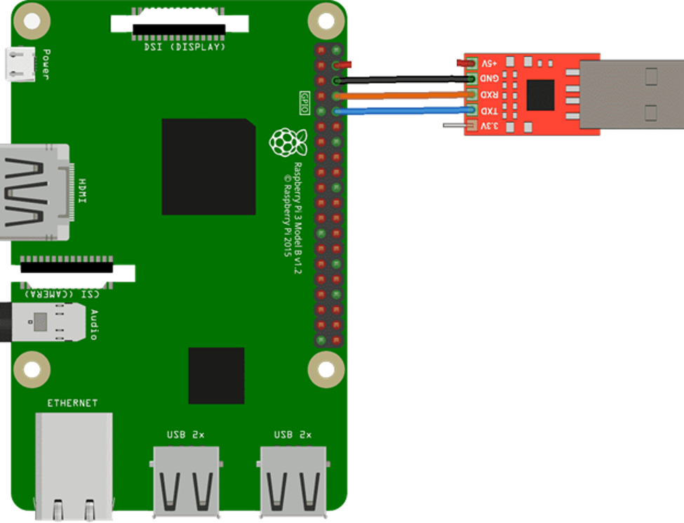
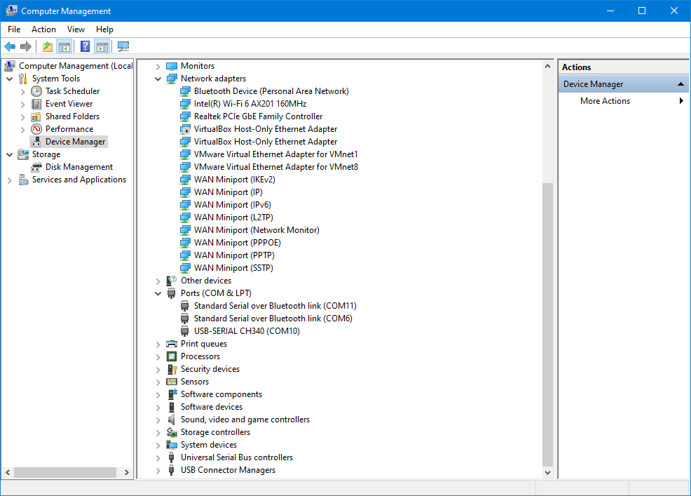
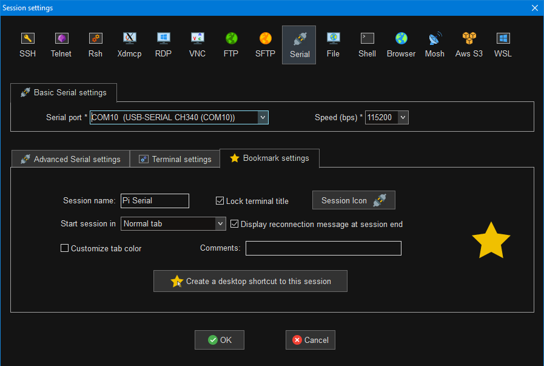
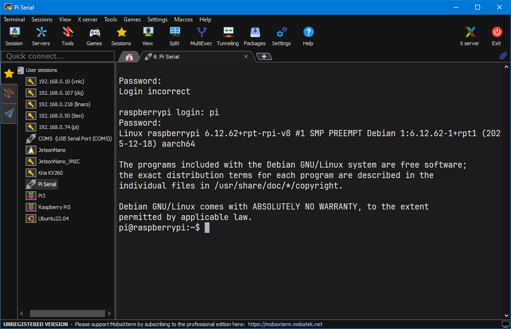
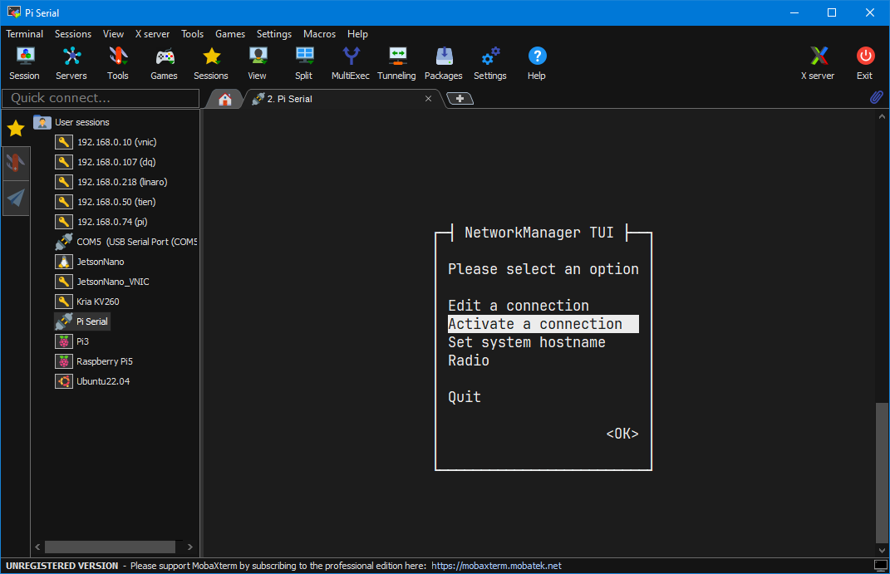
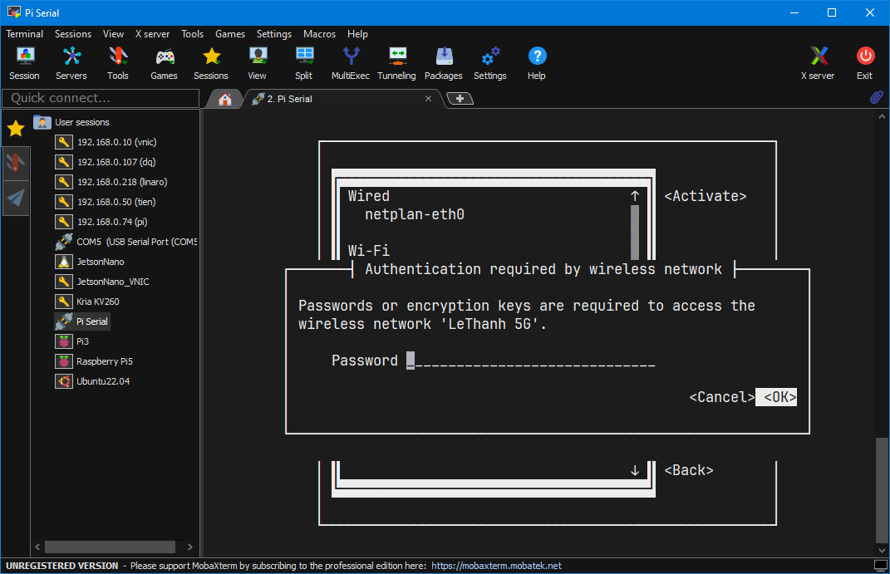

<h1 align="center" >Setup remote raspberrry pi with serial </h1>

## *1. Setup phần cứng*

<p align="center">
  
</p>

- `GND` (USB-TTL) ↔ `GND` của Pi (pin 6)

- `TXD` (USB-TTL) ↔ `RXD` của Pi (GPIO15, pin 10)

- `RXD` (USB-TTL) ↔ `TXD` của Pi (GPIO14, pin 8)

## *2. Xác định cổng COM*
Cắm USB-TTL vào PC → mở Device Manager → mục Ports (COM & LPT)

Sẽ thấy cổng serial VD “USB-SERIAL CH340 (COM10)”.

`Chú ý`: Nếu không thấy kiểm tra lại kết nối dây trên pi và usb ttl xem đúng hay chưa

<p align="center">
  
</p>

## *3. Tạo Session Serial trong MobaXterm*
1.	Mở `MobaXterm` → `Session`
2.	Chọn tab `Serial`
3.	Điền:
- `Serial port`: chọn đúng COMxx (ví dụ COM10 – USB-SERIAL CH340)
- `Speed (bps)`: 115200
- Chọn `Bookmark settings` chọn `Session name`: để đổi tên session

<p align="center">
  
</p>

## *4. Login vào Pi*

Sau khi tạo session kế tiếp nhấp đúp vào biều tượng vừa tạo góc bên trái và đang nhập vào pi. Sau khi login thì sẽ hiển thị 1 terminal như trong hình `pi@raspberrypi:~$`

*`Chú ý: `* Nếu nhấp vào không thấy chữ login thì `Enter`

<table border="1" cellpadding="8" cellspacing="0">
  <tr>
    <th>Raspberrypi login</th>
    <th>Password</th>
  </tr>
  <tr>
    <td>pi</td>
    <td>1234</td>
  </tr>
</table>

<p align="center">
  
</p>

## *5. Setup networking*

Dùng lệnh trên xem ip đã có hay chưa. Như trên hình là đã có vs ip là `192.168.0.140`
```
ifconfig
```

<p align="center">
  
</p>

Nếu chưa có thì làm với lệnh sau:
```
sudo nmtui
```
<p align="center">
  
</p>

Chọn `Activate a connection` sau đó lựa chọn mạng mình muốn r nhập passwd giống như hình.

<p align="center">
  
</p>

Sau khi nhập passwd nếu thành công thì hãy `Quit` thoát ra và kiểm tra lại 1 lần nữa có hiển thị ip hay không bằng lệnh `ifconfig`
